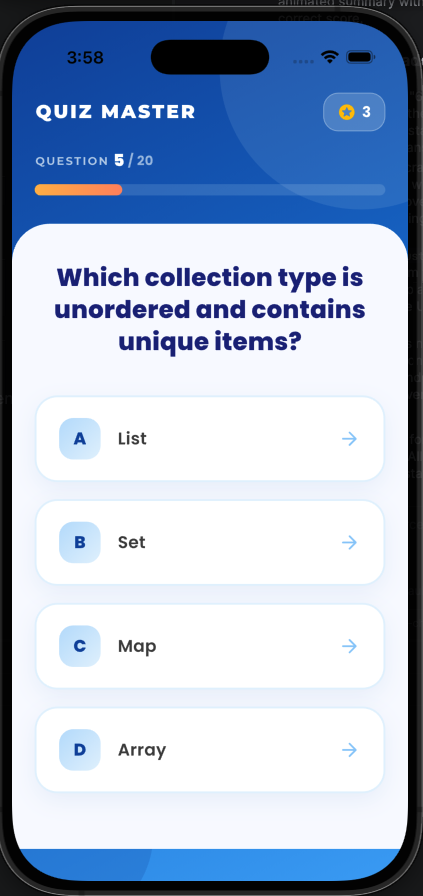
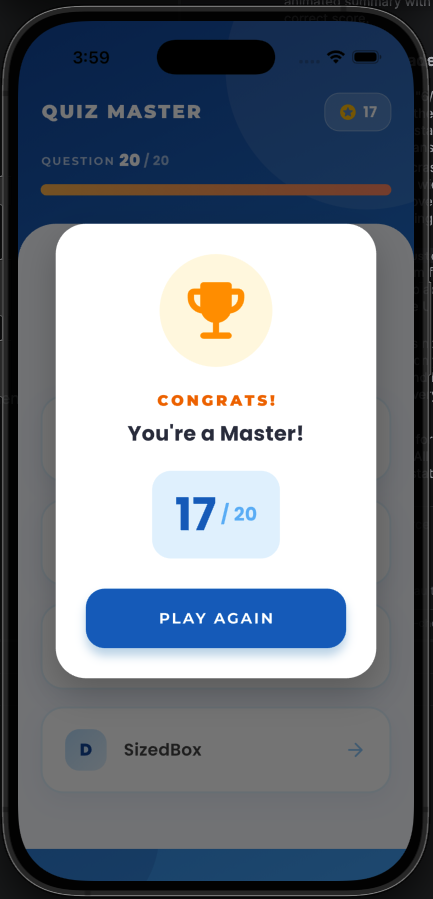

# Quiz Master 🚀

A polished, modern Flutter quiz application refactored with **Clean Architecture** and **Riverpod** for robust state management.

## ✨ Features

- **Modern UI/UX**: Clean, responsive design using `google_fonts` (Poppins & Montserrat).
- **State Management**: Powered by `flutter_riverpod` using `StateNotifierProvider`.
- **Clean Architecture**: Separated into `data`, `models`, `providers`, `screens`, and `widgets`.
- **Custom Animations**: 
  - Elastic transitions for dialogs and toasts.
  - Animated progress bar and question switching.
- **Interactive Feedback**: Real-time "Correct/Wrong" toasts that appear at the bottom for every selection.
- **20 Questions**: Comprehensive coverage of Dart and Flutter fundamentals.

## 📸 Screenshots

<p align="center">
  
  
</p>

## 🛠 Assets & Configuration

The project assets are organized in the following directory:
- `assets/images/`: Contains app screenshots and decorative assets.

Registered in `pubspec.yaml`:
```yaml
flutter:
  assets:
    - assets/images/
```

## 📁 Project Structure

```text
lib/
├── data/           # Quiz questions and static data
├── models/         # Immutable data models
├── providers/      # State management and business logic
├── screens/        # UI Screens (Composition)
├── widgets/        # Reusable UI components
└── main.dart       # App entry point
```

## 🚀 Getting Started

1. **Install dependencies**:
   ```bash
   flutter pub get
   ```
2. **Run the app**:
   ```bash
   flutter run
   ```
